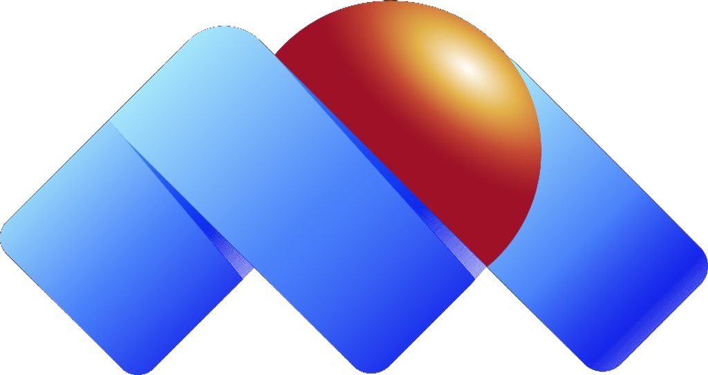

<div align="center">



# Auto Casco · Inspección Digital

**La Mundial de Seguros**

[](https://github.com/jsotoexelixitech/auto-casa)
[](https://react.dev)
[](https://vitejs.dev)
[](https://tailwindcss.com)
[](LICENSE)
[](CONTRIBUTING.md)

*Plataforma web progresiva (PWA-ready) para la inspección digital de vehículos asegurados.  
Inspección guiada con IA, emisión de pólizas, cobertura por días, siniestros y pagos — todo en un solo flujo.*

[Demo en vivo](#) · [Documentación técnica](DEPLOY.md) · [Reportar un error](https://github.com/jsotoexelixitech/auto-casa/issues) · [Solicitar función](https://github.com/jsotoexelixitech/auto-casa/issues/new)

</div>

---

## Tabla de contenidos

- [Visión del producto](#-visión-del-producto)
- [Capturas de pantalla](#-capturas-de-pantalla)
- [Características](#-características)
- [Stack tecnológico](#-stack-tecnológico)
- [Arquitectura del proyecto](#-arquitectura-del-proyecto)
- [Inicio rápido](#-inicio-rápido)
- [Variables de entorno](#-variables-de-entorno)
- [Scripts disponibles](#-scripts-disponibles)
- [Usuarios de prueba](#-usuarios-de-prueba)
- [Módulos funcionales](#-módulos-funcionales)
- [Identidad de marca](#-identidad-de-marca)
- [Guía de despliegue](#-guía-de-despliegue)
- [Hoja de ruta](#-hoja-de-ruta)
- [Contribuir](#-contribuir)
- [Seguridad](#-seguridad)
- [Licencia](#-licencia)

---

## 🎯 Visión del producto

**Auto Casco · Inspección Digital** digitaliza y automatiza el proceso completo de inspección de vehículos para la aseguradora **La Mundial de Seguros**, eliminando el papeleo y reduciendo el tiempo de inspección de horas a minutos.

La plataforma conecta tres actores:

| Actor | Rol |
|---|---|
| **Asegurado** | Realiza la inspección auto-gestionable desde su teléfono |
| **Perito** | Valida, aprueba o rechaza inspecciones y siniestros |
| **Administrador** | Supervisa KPIs, gestiona usuarios y pólizas |
| **Intermediario** | Emite pólizas y hace seguimiento de la cartera |

---

## 📸 Capturas de pantalla

> Las capturas se generan automáticamente en cada release. Ver la carpeta `/docs/screenshots/` (próximamente).

---

## ✨ Características

### Inspección digital guiada
- 🔍 **12 secuencias fotográficas** con IA simulada para validar calidad, placa y estado de piezas
- 📍 **Geolocalización automática** con GPS del dispositivo y dirección legible
- 📄 **OCR de documentos** — extracción automática desde cédula, RIF y carnet de circulación
- 🎥 **Video 360°** — carga del recorrido perimetral del vehículo
- 🏷️ **Clasificación de piezas** — estado B / R / M / NE por cada componente
- 📝 **Firma y reporte final** con PDF descargable

### Pólizas y cobertura
- 📅 **Cobertura por días** — activa tu protección solo cuando manejes
- 💰 **Cobertura por saldo** — descuento automático por km recorrido
- ⚡ **Activación instantánea** desde la app
- 📋 **Emisión de pólizas** paso a paso con validaciones

### Siniestros
- 🚗 **Reporte inmediato** con formulario guiado (tipo, severidad, lugar, descripción)
- 📊 **Timeline de seguimiento** en tiempo real
- 🤝 **Asignación automática** de perito
- 📥 **PDF del reporte** descargable en el acto

### Pagos
- 💳 **Múltiples métodos** — tarjeta, transferencia, Pago Móvil
- 🔐 **Vista previa de tarjeta** con detección de marca (Visa / Mastercard / AmEx / Discover)
- 📊 **Historial completo** de movimientos con exportación
- ♻️ **Recarga de saldo** con quick-picks

### Experiencia de usuario
- 🔎 **Búsqueda global** (`Cmd+K` / `Ctrl+K`) — pólizas, inspecciones y siniestros
- 🔔 **Notificaciones** con navegación inteligente y marcado de leídas
- 💬 **Chat en vivo** con asistente virtual Sofía (respuestas contextuales)
- 📹 **Videollamada con perito** — agenda in-app con sala simulada
- 🌐 **Totalmente responsivo** — mobile-first, cero scroll horizontal, bottom nav para móvil
- 🎨 **Identidad oficial** La Mundial de Seguros (Azul Pennsylvania + Rojo Imperial)

---

## 🛠 Stack tecnológico

| Capa | Tecnología | Versión |
|---|---|---|
| UI Framework | [React](https://react.dev) | 18 |
| Bundler / Dev server | [Vite](https://vitejs.dev) | 8 |
| Estilos | [Tailwind CSS](https://tailwindcss.com) | 3 |
| Routing | [React Router DOM](https://reactrouter.com) | 6 |
| Estado global | React Context API | — |
| Íconos | [Material Symbols](https://fonts.google.com/icons) | Variable font |
| Tipografía | [Poppins](https://fonts.google.com/specimen/Poppins) + [Playfair Display](https://fonts.google.com/specimen/Playfair+Display) | — |
| CSS utils | [clsx](https://github.com/lukeed/clsx) | — |
| Servidor (prod) | [serve](https://github.com/vercel/serve) + PM2 | — |
| Túnel externo | [Cloudflare Tunnel](https://developers.cloudflare.com/cloudflare-one/connections/connect-apps/) | — |
| Linting | ESLint | 9 |

---

## 🏗 Arquitectura del proyecto

```
auto-casa-inspeccion/
│
├── public/                          # Activos estáticos
│   ├── logo-isotipo-transparente.png
│   └── favicon.ico
│
├── src/
│   ├── components/
│   │   ├── layout/                  # Estructura de la app
│   │   │   ├── AppLayout.jsx        # Contenedor principal + BottomNav
│   │   │   ├── SideNav.jsx          # Sidebar (drawer en móvil)
│   │   │   ├── TopNav.jsx           # Barra superior + búsqueda global
│   │   │   └── BottomNav.jsx        # Navegación inferior móvil (FAB)
│   │   ├── ui/                      # Componentes atómicos reutilizables
│   │   │   ├── Brand.jsx            # Logotipo + Wordmark La Mundial
│   │   │   ├── Icon.jsx             # Material Symbols wrapper
│   │   │   ├── Modal.jsx            # Dialog / bottom-sheet responsive
│   │   │   ├── PageHeader.jsx       # Cabecera de página con breadcrumbs
│   │   │   ├── StatCard.jsx         # Tarjeta de KPI
│   │   │   ├── StatusChip.jsx       # Chip de estado semántico
│   │   │   └── Stepper.jsx          # Indicador de pasos
│   │   └── WelcomeSplash.jsx        # Pantalla de bienvenida animada
│   │
│   ├── context/                     # Estado global (Context API)
│   │   ├── AuthContext.jsx          # Autenticación + rol de usuario
│   │   ├── DataContext.jsx          # Datos demo + helpers CRUD
│   │   └── ToastContext.jsx         # Notificaciones in-app
│   │
│   ├── data/
│   │   └── mockData.js              # Seed data: usuarios, vehículos,
│   │                                #  pólizas, inspecciones, siniestros,
│   │                                #  pagos, actividad, OCR templates
│   │
│   ├── pages/
│   │   ├── LoginPage.jsx            # Autenticación con selector de rol
│   │   ├── DashboardPage.jsx        # KPIs, actividad reciente, vehículos
│   │   ├── PoliciesPage.jsx         # Listado de pólizas
│   │   ├── PolicyDetailPage.jsx     # Detalle + descarga PDF + compartir
│   │   ├── InspectionsListPage.jsx  # Listado + filtros de inspecciones
│   │   ├── InspectionWizardPage.jsx # Wizard 5 pasos
│   │   ├── CoveragePage.jsx         # Activar cobertura + planes
│   │   ├── EmissionPage.jsx         # Emisión de póliza paso a paso
│   │   ├── SiniestrosPage.jsx       # Siniestros + reporte + detalle
│   │   ├── PaymentsPage.jsx         # Pagos + métodos + historial
│   │   ├── ProfilePage.jsx          # Perfil personal + seguridad
│   │   ├── SettingsPage.jsx         # Preferencias, notificaciones, privacidad
│   │   ├── HelpPage.jsx             # Chat, videollamada, FAQs, contacto
│   │   ├── NotFoundPage.jsx         # Error 404
│   │   └── inspection/              # Sub-pasos del wizard
│   │       ├── Step1Documents.jsx   # OCR de documentos
│   │       ├── Step2Location.jsx    # Captura GPS
│   │       ├── Step3Photos.jsx      # 12 secuencias fotográficas + IA
│   │       ├── Step4Damages.jsx     # Reporte de daños + video 360°
│   │       └── Step5Review.jsx      # Revisión y firma
│   │
│   ├── utils/
│   │   └── downloadPdf.js           # Generador de PDF sin dependencias externas
│   │
│   ├── App.jsx                      # Router principal + rutas protegidas
│   ├── main.jsx                     # Entry point React
│   └── index.css                    # Estilos globales + componentes Tailwind
│
├── ecosystem.config.cjs             # PM2 — Producción
├── ecosystem.dev.config.cjs         # PM2 — Desarrollo + Tunnel
├── start-dev.sh                     # Script Bash: dev + tunnel en foreground
├── tailwind.config.js               # Tema extendido (colores, tipografía, sombras)
├── vite.config.js                   # Vite (allowedHosts Cloudflare)
├── DEPLOY.md                        # Guía completa de despliegue
├── CHANGELOG.md                     # Historial de cambios
├── CONTRIBUTING.md                  # Guía de contribución
├── SECURITY.md                      # Política de seguridad
└── CODE_OF_CONDUCT.md               # Código de conducta
```

---

## 🚀 Inicio rápido

### Prerrequisitos

- **Node.js** ≥ 20 LTS ([descargar](https://nodejs.org))
- **npm** ≥ 10 (incluido con Node)
- **Git** ([descargar](https://git-scm.com))

### Clonar e instalar

```bash
git clone https://github.com/jsotoexelixitech/auto-casa.git
cd auto-casa
npm install
```

### Iniciar en desarrollo

```bash
npm run dev
# → http://localhost:5173
```

### Build de producción

```bash
npm run build     # compila en dist/
npm run preview   # sirve el build localmente
```

---

## 🔧 Variables de entorno

La aplicación **no requiere variables de entorno** para funcionar en modo demo — todos los datos son mock y se procesan en el cliente.

Para una integración con backend real, crea un archivo `.env.local`:

```env
# API Backend (futuro)
VITE_API_BASE_URL=https://api.lamundial.com/v1

# Feature flags
VITE_ENABLE_REAL_OCR=false
VITE_ENABLE_REAL_GPS=true
VITE_ENABLE_REAL_PAYMENTS=false
```

> Nunca subas `.env.local` ni `.env.production` al repositorio. Están en el `.gitignore`.

---

## 📜 Scripts disponibles

| Comando | Descripción |
|---|---|
| `npm run dev` | Servidor de desarrollo con HMR en puerto 5173 |
| `npm run build` | Build optimizado de producción en `dist/` |
| `npm run preview` | Previsualiza el build de producción localmente |
| `npm run lint` | Análisis estático con ESLint |
| `npm run dev:cloud` | Dev + Cloudflare Tunnel público (requiere `cloudflared`) |
| `npm run tunnel` | Solo el Cloudflare Tunnel apuntando a localhost:5173 |

---

## 👥 Usuarios de prueba

Al abrir la app, haz clic en cualquiera de estos usuarios pre-cargados en el login:

| Nombre | Correo | Rol | Acceso |
|---|---|---|---|
| Miguel Azualde | `miguel.azualde@lamundial.com` | Perito | Validar / gestionar inspecciones |
| Joelmis Materano | `joelmis.materano@exelixitech.com` | Perito | Coordinación de procesos |
| Carolina Rivas | `carolina.rivas@gmail.com` | Asegurado | Ver mis pólizas e inspecciones |
| Rodrigo Pérez | `rodrigo.perez@gmail.com` | Asegurado | Ver mis pólizas e inspecciones |
| Admin Sistema | `admin@lamundial.com` | Administrador | Acceso completo |

> La contraseña es libre — el login demo acepta cualquier valor no vacío.

---

## 📦 Módulos funcionales

### 1. Autenticación
- Selector visual de usuario con roles
- Rutas protegidas con `ProtectedRoute`
- Estado persistido en `AuthContext`

### 2. Dashboard
- KPIs en tiempo real (pólizas activas, días restantes, inspecciones)
- Vehículos del usuario con acción directa
- Feed de actividad reciente
- Accesos rápidos por rol

### 3. Inspección (Wizard 5 pasos)
| Paso | Descripción |
|---|---|
| 1 · Documentos | Carga y OCR de cédula / RIF / carnet de circulación |
| 2 · Ubicación | GPS automático + mapa estático + dirección legible |
| 3 · Fotos | 12 secuencias guiadas con validación IA simulada |
| 4 · Daños | Diagrama de piezas, clasificación B/R/M/NE, video 360° |
| 5 · Revisión | Resumen completo, firma digital, envío al perito |

### 4. Pólizas
- Listado con filtros (estado, plan, búsqueda)
- Detalle completo con coberturas e inspecciones asociadas
- Descarga de póliza en PDF
- Compartir por Web Share API / clipboard

### 5. Cobertura
- Comparador de planes (Básico / Estándar / Premium)
- Calculadora de costo por días
- Activación inmediata con confirmación

### 6. Emisión
- Wizard de 4 pasos para emitir una nueva póliza

### 7. Siniestros
- Reporte con formulario completo (tipo, severidad, lugar, heridos, autoridad)
- Timeline de seguimiento por fases
- Descarga del reporte en PDF

### 8. Pagos
- Recarga de saldo con quick-picks ($20 / $50 / $100 / $200)
- Gestión de métodos de pago (tarjeta, transferencia, Pago Móvil)
- Historial de movimientos (ingresos y egresos)

### 9. Perfil y Configuración
- Edición de datos personales
- Gestión de seguridad (2FA, sesiones, contraseña)
- Preferencias de tema, densidad, idioma, moneda y zona horaria
- Privacidad, exportación y eliminación de cuenta

### 10. Ayuda
- Chat en vivo con asistente virtual **Sofía**
- Agenda de videollamada con perito
- Preguntas frecuentes
- Formulario de contacto

---

## 🎨 Identidad de marca

La interfaz sigue al pie de la letra el **Manual de Identidad de La Mundial de Seguros**.

| Token | Color | Uso |
|---|---|---|
| `brand` · `primary` | `#0F1A5A` Azul Pennsylvania | Fondos, botones primarios, sidebar |
| `accent` | `#E84F51` Rojo Imperial | CTAs, FAB, alertas, acciones urgentes |
| `silver` | `#ACACAC` Plata | Bordes, secundarios, disabled |

**Tipografía:**
- **Poppins** — texto UI (sans-serif principal)
- **Playfair Display Italic** — wordmark "La Mundial de Seguros" (sustituto web de Constantia Bold Italic)

**Gradientes:**
- `gradient-brand` — azul profundo → Azul Pennsylvania → navy oscuro
- `gradient-accent` — rojo claro → Rojo Imperial → rojo oscuro
- `gradient-sunrise` — degradado rojo/azul para fondos hero

---

## 🚢 Guía de despliegue

Ver [`DEPLOY.md`](DEPLOY.md) para instrucciones detalladas de:
- Despliegue con **PM2 + Cloudflare Tunnel** en servidor Linux
- Modo desarrollo con hot-reload
- Modo producción con build optimizado
- Actualización del código sin downtime
- Solución de problemas comunes

---

## 🗺 Hoja de ruta

### v1.1.0 — Integración Backend
- [ ] API REST para autenticación (JWT / OAuth2)
- [ ] Almacenamiento de fotos en S3 / Cloudflare R2
- [ ] OCR real con Google Vision API o Tesseract
- [ ] GPS con geocodificación real (Google Maps / Mapbox)
- [ ] WebSockets para notificaciones en tiempo real

### v1.2.0 — PWA completa
- [ ] Service Worker para modo offline
- [ ] Instalación como app nativa (A2HS)
- [ ] Captura de fotos directa con cámara nativa
- [ ] Push Notifications via Web Push API

### v1.3.0 — Reportería
- [ ] Dashboard analítico con gráficas (Recharts)
- [ ] Exportación a Excel / CSV
- [ ] Reportes periódicos por correo

### v2.0.0 — Plataforma multi-aseguradora
- [ ] Multi-tenancy por aseguradora
- [ ] White-labeling del frontend
- [ ] API pública documentada con OpenAPI 3.0

---

## 🤝 Contribuir

¡Las contribuciones son bienvenidas! Por favor lee [`CONTRIBUTING.md`](CONTRIBUTING.md) antes de abrir un PR.

En resumen:

1. Haz **fork** del repositorio
2. Crea tu rama: `git checkout -b feat/mi-nueva-funcionalidad`
3. Haz tus cambios y **escribe tests** (cuando aplique)
4. Asegúrate de que el lint pase: `npm run lint`
5. Haz **build** sin errores: `npm run build`
6. Abre el PR contra `main` con descripción clara

---

## 🔒 Seguridad

Ver [`SECURITY.md`](SECURITY.md) para conocer la política de divulgación responsable de vulnerabilidades.

---

## ⚖️ Bases legales y cumplimiento

### Propiedad intelectual
- La marca **La Mundial de Seguros**, su logotipo, paleta de colores e identidad visual son propiedad de **La Mundial de Seguros C.A.** y se usan bajo acuerdo de desarrollo de software con Exelixitech.
- El código fuente de esta plataforma es propiedad de **Exelixitech C.A.** bajo los términos de la licencia MIT (ver `LICENSE`).

### Protección de datos personales
- La plataforma maneja datos sensibles de asegurados (documentos de identidad, fotos de vehículos, ubicación GPS, datos financieros).
- En producción, se deben implementar: cifrado AES-256 en reposo, TLS 1.3 en tránsito, acceso por mínimo privilegio, auditoría de accesos, y política de retención de datos conforme a la legislación venezolana (Ley de Datos Personales).
- Esta versión **demo** no persiste datos en ningún servidor y opera únicamente en memoria del navegador.

### Marco regulatorio aplicable
- **Ley de la Actividad Aseguradora** (Venezuela) — Decreto Nº 1.449 con Rango, Valor y Fuerza de Ley
- **Reglamento de la Ley de la Actividad Aseguradora**
- **Providencias de la Superintendencia de la Actividad Aseguradora (SUDEASEG)** sobre inspección digital y digitalización de procesos
- **Ley Especial contra los Delitos Informáticos** — para el tratamiento seguro de datos en plataformas digitales
- **Normas COVENIN** aplicables a procesos de peritaje automotriz

---

## 📄 Licencia

```
MIT License

Copyright (c) 2026 Exelixitech C.A. — en nombre de La Mundial de Seguros C.A.

Se concede permiso, de forma gratuita, a cualquier persona que obtenga una copia
de este software y los archivos de documentación asociados (el "Software"), para
tratar el Software sin restricciones, incluyendo, sin limitación, los derechos
para usar, copiar, modificar, fusionar, publicar, distribuir, sublicenciar y/o
vender copias del Software, sujeto a las siguientes condiciones:

El aviso de copyright anterior y este aviso de permiso se incluirán en todas las
copias o porciones sustanciales del Software.
```

Ver el texto completo en [`LICENSE`](LICENSE).

---

<div align="center">

Desarrollado con ❤️ por **[Exelixitech C.A.](https://exelixitech.com)**  
para **La Mundial de Seguros C.A.** · Caracas, Venezuela · 2026

</div>
